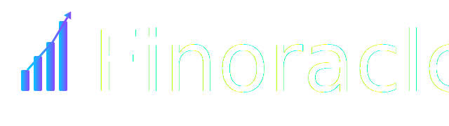

    

 

# Finoracle

**Finoracle** is an experimental trading and research platform built with **Rust**. Its goal is to provide a high-performance, modular environment for analyzing time-series market data, simulating trading strategies, and potentially executing trades at low latency via broker APIs.

The project is still in its early stages. It currently supports retrieval and visualization of historical financial data using the **Canvas API** (not third-party charting libraries), and is architected using [Dioxus](https://dioxuslabs.com/) — a Rust-based frontend framework with the potential for cross-platform deployment.

While inspired by high-frequency trading (HFT), Finoracle is not an institutional-grade system — rather, it is a personal research tool designed to explore the **intersection of trading, real-time systems, and machine learning**.

---

## 🔍 Why Finoracle?

- Built in **Rust** for performance, safety, and concurrency
- Avoids external charting libraries — uses **Canvas API** for custom time-series rendering
- Designed to be **modular and extensible**: plug in ML models, live data feeds, and strategy simulators
- Explores the feasibility of **real-time trading strategy execution** on accessible infrastructure

---

## 🚀 Current Features

- ⬇️ Fetches historical stock data from [Finnhub.io](https://finnhub.io/)
- 📈 Renders time-series line graphs using the **Canvas API** (not interactive yet)
- 🧱 Built using **Dioxus** for reactive UI and cross-platform potential
- 🧪 Modular architecture intended to support ML and data-streaming components

---

## 🔧 Planned Features

- 🖱️ Interactive graph features (tooltips on hover, zoom, crosshairs)
- 📡 Live market data via **WebSocket feed**
- ⚙️ CLI tools for backtesting trading strategies
- 🧠 Integration with ML models for predictive analysis
- 🔄 Broker API integration for test/paper trading (e.g. Alpaca, OANDA)
- 💹 Real-time trade simulation and latency benchmarking
- 📊 Visualization of trade signals, position history, and PnL
- 📦 Rust crate extraction for shared data and execution logic

---

## 🧱 Tech Stack

| Layer             | Technology            |
|------------------|-----------------------|
| UI Framework      | Dioxus (Rust)         |
| Data Fetching     | REST APIs (Finnhub)   |
| Visualization     | Canvas API (manual)   |
| ML/Modeling       | Planned: PyTorch or Burn |
| Real Trading API  | Planned: Alpaca/OANDA |
| Performance Layer | Rust (Tokio)          |

---

## 📎 Example Use Case (Future)

A future version of Finoracle might allow you to:
1. Subscribe to live stock prices via WebSocket
2. Run a predictive ML model trained offline
3. Automatically generate trade signals
4. Execute simulated or real trades using a broker API
5. Visualize live positions, signals, and profit/loss in real time

---

## 🌱 Why I Built This

Finoracle began as a personal exploration into **Rust-based systems**, **time-series visualization**, and the practical infrastructure required for real-time or low-latency trading environments.

I wanted to answer:
- Can a single developer build a lean, fast, intelligent trading platform from scratch?
- Can Rust serve as a credible base for **financial tooling** and **ML pipelines**?
- How might such a system evolve into a real product or consultancy offering?

The project remains in active development and serves both as a learning tool and a demonstration of my capabilities in **systems programming**, **finance**, and **fullstack architecture**.

---

## 📈 Long-Term Vision

Finoracle is not intended to directly compete with institutional HFT firms. Rather, it is designed to:
- Empower independent researchers and developers
- Explore low-latency architecture on accessible infrastructure
- Serve as a **springboard for future ML integrations**, consulting work, or product development

The door remains open to integrating real trade execution — either for personal use or as a proof-of-concept platform that others may wish to adopt or extend.

---

## 📂 License

MIT License — use, fork, and contribute freely.

---
